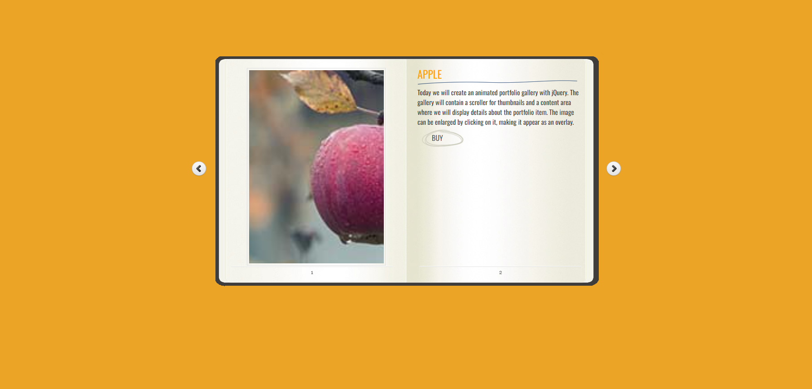

# Booklet Online Book Store

Questo progetto è un sito web che mostra una collezione di libri in un formato stile booklet. Ogni libro viene visualizzato con la copertina a sinistra e la descrizione a destra. È incluso un pulsante per consentire agli utenti di acquistare il libro.



## Tecnologie utilizzate

- **HTML** per la struttura del sito
- **CSS** per lo stile e la formattazione del layout
- **jQuery** per l'interattività, incluse animazioni e funzioni di navigazione

## Caratteristiche principali

- **Design stile booklet**: ogni pagina mostra un libro con la copertina e la descrizione.
- **Interfaccia utente pulita**: visualizzazione pulita e semplice che rende il sito piacevole e facile da navigare.
- **Pulsante di acquisto**: su ogni pagina del booklet, è presente un pulsante che consente agli utenti di acquistare il libro visualizzato.
  
## Struttura del sito

- **Homepage**: Introduzione e navigazione verso i vari libri.
- **Booklet**: Layout in stile booklet per visualizzare i dettagli di ogni libro.
  - **Copertina a sinistra**: visualizza l'immagine del libro.
  - **Descrizione a destra**: contiene il titolo, l'autore e una breve descrizione del libro.
  - **Pulsante di acquisto**: un pulsante "Acquista" che reindirizza gli utenti a una pagina di acquisto o un link esterno.

## Come utilizzare il progetto

1. **Clone del repository**
```bash
git clone https://github.com/l30-il-l30/booklet-online-bookstor.git
cd booklet-online-bookstore
```

## Come Aggiungere Nuovi Libri

Per aggiungere nuove pagine di libri sotto "other books", sblocca, copia e incolla il codice seguente nel tuo file HTML, e modifica i dettagli all'interno del commento `<!-- other books -->`.

```html
<div class="b-load">
<div class="cover">
    
</div>
<div>
    <h1>Apple</h1>
    <p>Today we will create an animated portfolio gallery with jQuery.
        The gallery will contain a scroller for thumbnails and a
        content area where we will display details about the portfolio
        item. The image can be enlarged by clicking on it, making
        it appear as an overlay.</p>
    <a href="" target="_blank" class="article">BUY</a>
</div>

<!-- other books -->
<!-- <div class="cover">
    
</div>
<div>
    <h1>Animated Portfolio Gallery</h1>
    <p>Today we will create an animated portfolio gallery with jQuery.
        The gallery will contain a scroller for thumbnails and a
        content area where we will display details about the portfolio
        item. The image can be enlarged by clicking on it, making
        it appear as an overlay.</p>
    <a href="" target="_blank" class="article">BUY</a>
</div> -->
</div>
```

## Come Avviare il Server con Docker

Il repository include i file necessari per ospitare il sito in un container. Utilizza il seguente comando per avviare il sito:

```bash
docker-compose up --build -d
```

oppure usa il **Dockerfile** in **./website**

```bash
docker build -t booklet-store .
docker run -p 80:80 booklet-store
```
